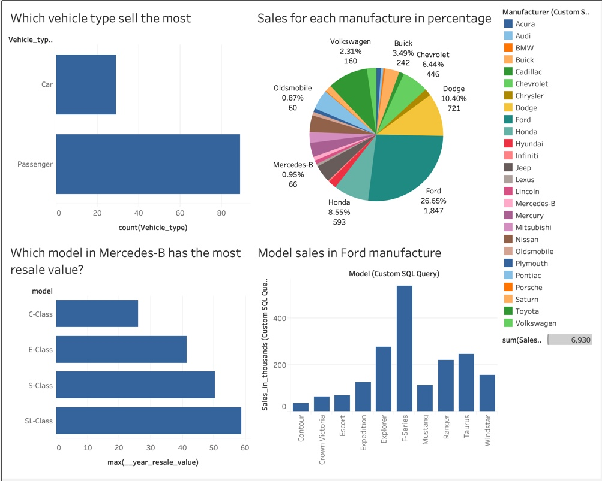

# Car-Sales-Analysis

This is the Car sales data set which include information about different cars . This data set is being taken from the Analytixlabs for the purpose of analysis.
I uses MySql to develop some queries in order to do the analysis. After that, I used Tableau to produce a chart for the ease of analysis.

These are the questions that I came up with for the analysis.
1) Among all the manufacturer, which manufacture has the most sale in the industry?
2) Which model in Ford manufacturer has the most sale?
3) Which model in Mercedes-B manufacture has the most resale value?
4) Which type of vehicle(Passenger/Car) sell the most?

1)MySql code:  

  Select Manufacturer, sum(Sales_in_thousands)  
  from car.car_sales  
  group by Manufacturer  
  
2)MySql code:  

  Select Model, Sales_in_thousands from car.car_sales  
  where Manufacturer = 'Ford'  
  order by Sales_in_thousands  

3)MySql code:  

  select model, max(__year_resale_value)  
  from car.car_sales  
  where Manufacturer = 'Mercedes-B'  
  group by model  
  
4)MySql code:  

  Select Vehicle_type, count(Vehicle_type)  
  from car.car_sales  
  group by Vehicle_type  
  
  
Below is the Tableau file that I have made:

